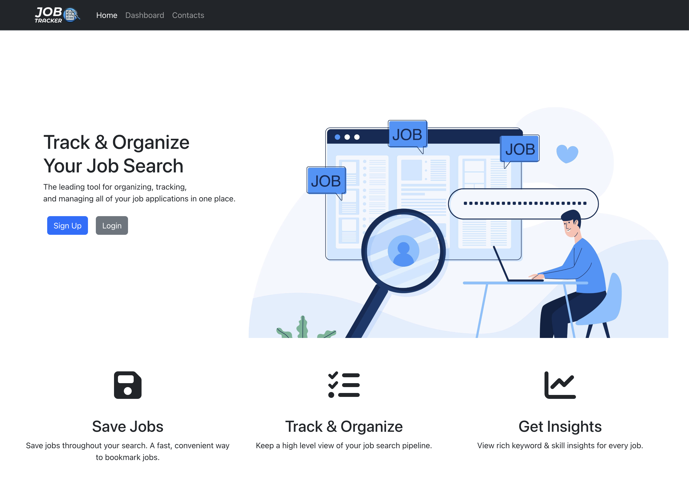

# Job Tracker

## Overview
The JobTracker application simplifies the job search by allowing users to track their job applications. It features a secure login, and a dashboard for adding and updating application details. It includes a graph that visualizes the number of applications submitted daily, helping users stay organized. Today’s job market is competitive for software engineers. We were inspired to create the Job Tracker application to streamline the job search. Our goal is to provide an intuitive platform that helps job seekers stay organized and manage their applications.

## Table of Contents
- [Setting up the development environment](#setting-up-the-development-environment)
  - [Clone the repository](#clone-the-repository)
  - [Environment variables](#environment-variables)
  - [Create and seed the MySQL database](#create-and-seed-the-mysql-database)
- [Build and run the application](#build-and-run-the-application)
- [Exploring the dashboard](#exploring-the-dashboard)
  - [Registration](#registration)
  - [Login](#login)
  - [Navigating the dashboard](#navigating-the-dashboard)
  - [Adding a job application](#adding-a-job-application)
  - [Updating a job application](#updating-a-job-application)
  - [Deleting a job application](#deleting-a-job-application)

## Setting up the development environment

### Clone the repository
Access the repository [here](https://github.com/sbjacobs231/job_tracker).  
Click the green “Code” button and select “Download ZIP” to download the project, or use Git to clone the repository:

```bash
git clone https://github.com/sbjacobs231/job_tracker.git
```
### Environment variables
1. Navigate to the `server` directory within the project folder.
2. Rename the `.env-example` file to `.env`.
3. Open the `.env` file and update the following variables with your MySQL credentials:
    ```sh
    MYSQL_USER=your_mysql_username
    MYSQL_PASSWORD=your_mysql_password
    ```

### Create and seed the MySQL database
1. Ensure your MySQL server is running.
2. Open your terminal or command prompt.
3. Navigate to the `server` directory of the project:
    ```sh
    cd path_to_job_tracker/server
    ```
4. Install server dependencies:
    ```sh
    npm install
    ```
5. Create and seed the database with test data:
    ```sh
    npm run seed-db
    ```

### Build and run the application
1. Stay in the `server` directory in your terminal or command prompt.
2. Start the server and build the client:
    ```sh
    npm run server
    ```
3. Once the build is complete, the Job Tracker application should be running on http://localhost:8080.

## Exploring the dashboard
You can explore the features of Job Tracker either in the development environment or by visiting our live site at http://34.173.21.246/.


### Registration
- Start by creating a new account. On the home page, click “Sign Up” and complete the registration form.
### Login
- After registering, return to the homepage and click “Login.” Enter your username and password to access the dashboard.
- Or if you skipped the registration step you can login with our test user:
    ```
    Username: testuser
    Password: password
    ```

### Navigating the dashboard
- Upon logging in, you’ll be directed to the dashboard. Here, you’ll find the “Apply Count Per Day” chart, a jobs table, and a job submission form.

### Adding a job application
- To add a new job, use the form located on the bottom of the page. Fill in the required details and click “Submit”. The new job will appear in the jobs table and the “Apply Count Per Day” chart will update to reflect the submission.

### Updating a job application
- To edit an existing job, click the pencil icon next to the job in the table. The form will automatically populate with the job’s details. Make your changes and click “Submit” to update the entry.

### Deleting a job application
- To remove a job, click the trash icon in the corresponding row. The job will be deleted from the table, and the “Apply Count Per Day” chart will update accordingly.


## Collaborators
- [Sky Jacobson](https://github.com/sbjacobs231)
- [Su Youn Jeon](https://github.com/tndus604)
- [Julian Paulo Torres](https://github.com/juliannogueira)